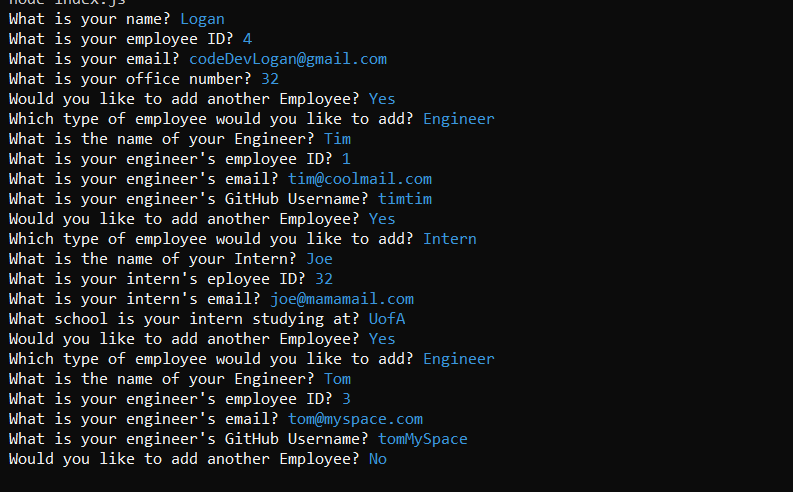

# Meet-The-Team-Generator

## Description

I wanted to create an application to allow project managers to quickly make a mock intro page for their team and keep track of their employees. Also, like with most of my utility apps I wanted the person using it to spend less time bookkeeping and more time coding.

## Table of Contents

- [Installation](#installation)
- [Usage](#usage)
- [Contribute](#contribute)
- [Deployment](#deployment)
- [Questions](#questions)
- [License](#license)

## Installation

To install the program you must clone the repository to your local machine and install NodeJS once done install npm with npm i to ensure you have the apropriate dependinces.

## Usage

To use the application, first install it, see above, then run the command node index.js. Then follow the prompts on screen.

## Deployment

https://github.com/codeDevLogan/Meet-The-Team-Page-Generator

## Contribute

To contribute feel free to clone the repo and work on it. I'll look over any pull requests when I have time to do so. I would love to see what you come up with.

## Tests

The tests are alread in the file. You can run the command npm test to run them and ensure everthing works correctly.

## License

## Questions

Got Questions?

Email Me: [Email](mailto:codeDevLogan@gmail.com)

GitHub: [codeDevLogan](https://github.com/codeDevLogan)
